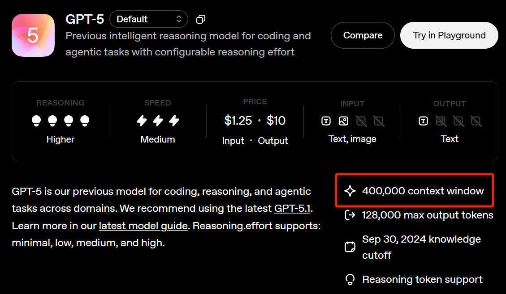

# Configuration

ChromaPilot reads **one** configuration file. `setup.sh` creates it from
`config.example.yaml`:

```
config.yaml                              used by the command line and by `import agent`
chromapilot/interface/config.yaml        used by the web interface
```

Both are git-ignored. The interface deliberately does not fall back to the root
config: copy `chromapilot/interface/config.example.yaml` to `config.yaml` in that
folder, or point `IFACE_CONFIG` at a config you already have.

```yaml
conda_env: 'chromapilot'

langsmith:
  trace: 'false'
  api_key: ''

llm:
  provider: 'auto'
  model: 'claude-sonnet-4-6'
  api_key: 'YOUR_API_KEY_HERE'
  admin_api_key: ''
  base_url: null

limit:
  max_tokens: 200000
  report_enabled: 'true'
  rag_verbose: 'false'
```

---

## `conda_env`

Name of the environment `setup.sh` created. The agent shells out to this
environment when it runs generated code, so a wrong value shows up as
*"ModuleNotFoundError"* inside an autocode step even though the same import
works in your shell.

## `llm` — the model

### `api_key` (required)

The one field you must set. **Never commit it.** If a key is ever exposed,
revoke it at the provider and issue a new one — rotating the key is the only
real fix.

Where to get one:

| Provider | Sign up | Create a key |
|---|---|---|
| Anthropic | <https://console.anthropic.com> | Settings → API keys |
| OpenAI | <https://platform.openai.com/signup> | <https://platform.openai.com/api-keys> |
| Google | <https://aistudio.google.com> | Get API key |

### `provider` and `model`

| `provider` | `model` examples | Key prefix |
|---|---|---|
| `anthropic` | `claude-sonnet-4-6`, `claude-haiku-4-5-20251001` | `sk-ant-…` |
| `openai` | `gpt-5` | `sk-proj-…`, `sk-…` |
| `google` | `google_genai:gemini-2.5-flash-lite` | *(no prefix — set `provider` explicitly)* |

`provider: 'auto'` infers the provider from the key prefix, which works for
Anthropic and OpenAI. Google keys carry no distinguishing prefix, so name the
provider yourself.

**Which model?** Planning quality is what matters — the plan decides the whole
run, and you review it before any compute is spent. A frontier model
(`claude-sonnet-4-6`, `gpt-5`) plans noticeably better on novel requests. A
smaller model is fine for repeating a pipeline you have already validated, and
cuts planning latency substantially.

### `base_url`

Leave `null` for Anthropic and Google. Set it for OpenAI-compatible endpoints
(a proxy, a gateway, Azure) — `https://api.openai.com/v1` is the default when
`provider: 'openai'`.

### `admin_api_key`

Optional, and unrelated to running the agent. An organization admin key lets a
run query the provider's usage API afterwards and record tokens spent in
`summary.txt`. Without it, runs work normally and token counts read `0`.

## `limit` — runtime limits

### `max_tokens`

The context window (input **+** output) allowed per LLM request. Set it to what
your model actually supports — too high and requests fail; too low and the agent
truncates context it needed.



Check the provider's model page:
[Anthropic](https://docs.anthropic.com/en/docs/about-claude/models) ·
[OpenAI](https://platform.openai.com/docs/models) ·
[Google](https://ai.google.dev/gemini-api/docs/models).

### `report_enabled`

`'true'` runs the report stage after execution: the agent interprets each figure,
retrieves supporting literature, and compiles a PDF. It costs extra LLM calls and
a few minutes. `'false'` ends the run when execution finishes — the figures the
tools wrote are still on disk, just not narrated.

### `rag_verbose`

`'true'` prints which documents the retriever pulled, with scores, for every
decision. Useful when a plan cites something unexpected; noisy otherwise.

## `langsmith` — tracing (optional)

[LangSmith](https://smith.langchain.com) records every LLM call, tool call and
state transition, which makes a misbehaving plan much easier to diagnose.

```yaml
langsmith:
  trace: 'true'
  api_key: 'lsv2_pt_...'         # from https://smith.langchain.com/settings
```

Entirely optional. With `trace: 'false'` no account is needed and nothing leaves
your machine except the LLM calls themselves.

---

## Interface-only settings

`chromapilot/interface/config.example.yaml` accepts everything above plus an
optional **second provider**:

```yaml
llm:
  provider: 'auto'
  model: 'claude-sonnet-4-6'
  api_key: 'sk-ant-...'
  alt_model: 'gpt-5'
  alt_api_key: 'sk-proj-...'
  alt_base_url: 'https://api.openai.com/v1'
```

With both keys present, a model dropdown appears on the interface start screen
and you pick the LLM per run. With one key, that key is simply used.

Environment variables the interface honours:

| Variable | Default | Meaning |
|---|---|---|
| `IFACE_CONFIG` | `interface/config.yaml` | Path to the config file |
| `IFACE_PYTHON` | the active env's `python3` | Interpreter to run under |
| `IFACE_MODEL` | *(unset)* | Override just the model id, e.g. `claude-haiku-4-5-20251001` |
| `IFACE_PORT` | `8800` | Server port |
| `IFACE_HOST` | `0.0.0.0` | Bind address |

## Keeping your key safe

* `config.yaml` (both of them) is in `.gitignore`. Keep it that way.
* Run `git status` before your first commit and confirm no `config.yaml` appears.
* The agent masks the key in its start-up banner (`sk-an…dQA`), so run logs are
  safe to share.
* If you keep configs elsewhere, pass `-c /path/to/config.yaml` on the command
  line or set `IFACE_CONFIG` — nothing has to live inside the repository.
